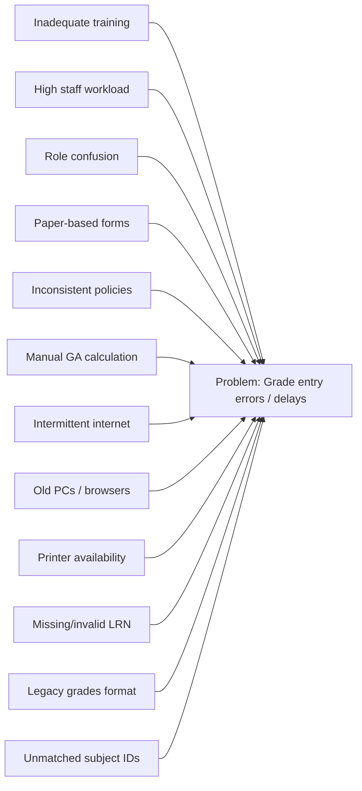
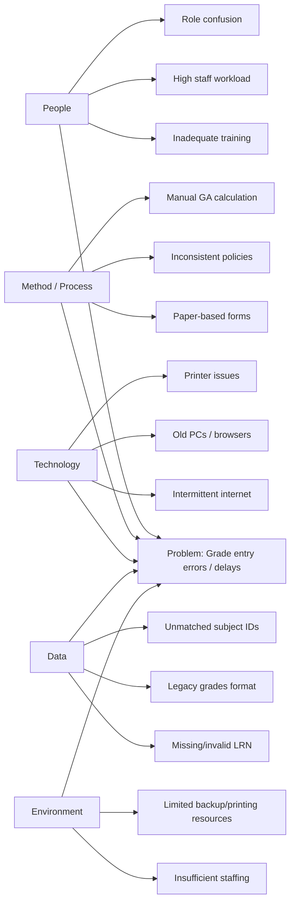

### Development model (short)

- Iterative–Incremental (Agile-oriented): deliver in short cycles, gather stakeholder feedback, and refine features.

### Development steps (short)

1. Requirement analysis — gather stakeholder needs.
2. System design — diagrams and DB schema.
3. Implementation — build in sprints (auth, students, subjects, grades, locks, export).
4. Testing & acceptance — unit, integration, and UAT.
5. Deployment — release to production.
6. Continuous — monitor, maintain, and iterate.

This chapter describes the methodological framework used to guide the design, development, testing, deployment, and maintenance of the SF10 Learner Record Management System. Its purpose is to make the project process transparent, repeatable, and verifiable by documenting the chosen development approach, the sequence of activities performed, the roles and responsibilities of stakeholders, the tools and artifacts produced, and the measures taken to ensure quality, security and data integrity.

Scope: the methodology covers the full lifecycle of the system from requirements elicitation through system design, iterative implementation, testing, deployment, and post‑deployment maintenance. Deliverables produced under this methodology include the database schema, application source code, design diagrams (Context, ERD, DFD, flowcharts), test reports, deployment instructions, and user documentation.

Objectives: the primary objectives are to deliver a stable, secure and auditable SF10 generation system that supports teacher grade entry workflows, enforces quarter locks, supports remedial processes and produces printable SF10 reports; to involve stakeholders early and often for validation; and to ensure the solution is maintainable and reproducible in production environments.

Approach and rationale: an Iterative–Incremental (agile-oriented) development model was adopted to allow incremental delivery of high‑value features (authentication, student management, grade entry, export) and rapid feedback cycles with teachers and administrators. Each iteration included design updates, development tasks, testing, and a review with stakeholders so that business rules (GA computation, skip lists, transfer-student overrides) could be validated and refined.

Roles and responsibilities: primary stakeholders include teachers (functional users and validators), school administrators/registrar (data stewards and report consumers), and the development team (design, implementation, test, deployment). Testers and maintainers were responsible for verification, logging, backups and applying security hardening prior to production rollout.

Assumptions and constraints: development was performed on a LAMP/XAMPP local environment and targeted MySQL/MariaDB in production. The methodology assumes stakeholder availability for periodic reviews, access to representative data for testing, and adherence to data protection policies when handling student records. Resource constraints (time, hosting) and existing legacy data formats shaped some implementation choices.

Quality assurance and reproducibility: the process emphasized server‑side validation, audit logging of data changes, DB backups prior to schema changes, and version control for source code. Testing included unit and integration checks for grade calculation logic and manual acceptance tests with real or representative datasets. All diagrams and schema are stored in the repository to allow reproduction of the system environment and behavior.

### Environment and Locale

This study was carried out in partnership with New Mabuhay Elementary School (NMES), located in Barangay Mabuhay, General Santos City. NMES traces its origins to the early 1980s, officially established around 1980 to provide local access to primary education. It grew from an annex of Lagao National High School (LNHS) into an independent elementary school serving the surrounding community and has celebrated milestone anniversaries, including its 45th anniversary in late 2025.

Key milestones and local context:

- 1980s: Community demand for a local elementary school in Barangay Mabuhay led to the creation of a local annex and the vision for NMES.
- 1990s: Lagao National High School operated an extension in Barangay Mabuhay to serve growing enrollment; local records and secondary sources document this phase.
- 1995: The extension arrangements matured and nearby institutions reorganized; NMES consolidated its presence as an independent elementary school.
- Present: NMES continues to serve primary education needs in the locality, maintaining partnerships with municipal education offices and celebrating notable anniversaries.

Data and access: the partner school provided sample datasets (student records, enrollment lists and historical grade sheets) for testing and UAT. Site visits and stakeholder meetings were conducted at the school to validate workflows and to gather qualitative feedback from teachers and administrators.

Figures: include a map or Google Maps embed showing the school's location, and photographs of the school's façade and facilities. Label such images as "FIGURE 2.0" in the List of Figures for the thesis.

Notes on locality: the system design considered local constraints such as intermittent internet access, typical desktop/laptop workstations in the registrar's office, and printers/scanners used for SF10 distribution. These influenced decisions about offline-friendly export options (PDF/Excel) and simple deployment instructions for XAMPP/LAMP environments.

### Operational Feasibility

This section uses cause-and-effect (fishbone) analysis to identify operational problems encountered by the existing process and the system design responses. Below are compact fishbone diagrams rendered in Mermaid (placeholders you can preview in VS Code Mermaid) and short mitigation actions.

Mitigations (short):
- People: short hands-on trainings, step-by-step user manual, and clear role-based UI guidance.
- Process: standardize grade-entry procedures, require LRN and mandatory fields, and enable draft-save workflows.
- Technology: provide offline-capable exports (PDF/Excel), recommend minimum hardware/browser versions, and document printing steps.
- Data: implement server-side validation, LRN checksum/matching, and migration scripts to normalize legacy grade formats.

Figures: export the fishbone above as `docs/figures/FIGURE_4.0_fishbone.png` (use VS Code Mermaid Preview or `mmdc`) and include it in the List of Figures.

Operational feasibility conclusion: the SF10 system reduces entry errors and delays by clarifying roles and processes, enforcing data validation, logging changes for audit, and offering resilient export options for low-connectivity environments.

**Mermaid fishbone (renderable)**

Use your Mermaid preview in VS Code or mermaid.live to render this block. It lays out cause categories on the left and the effect on the right for a fishbone-like view.
