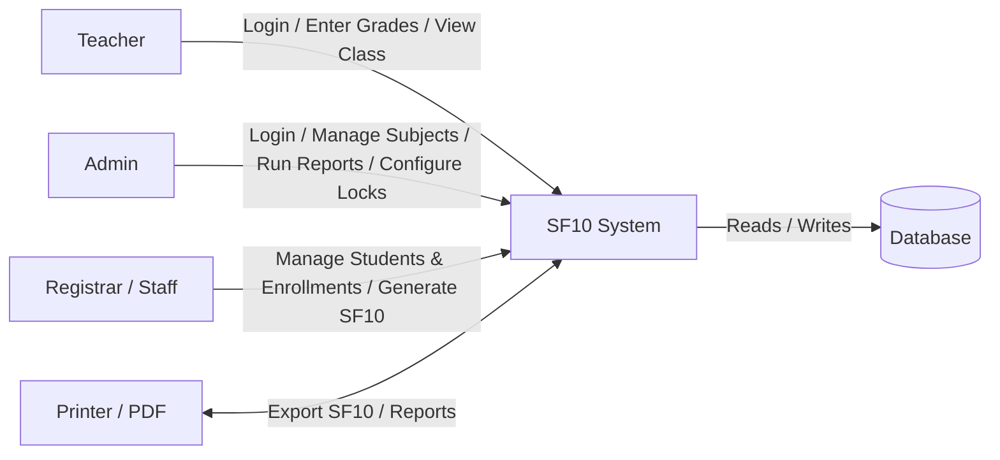
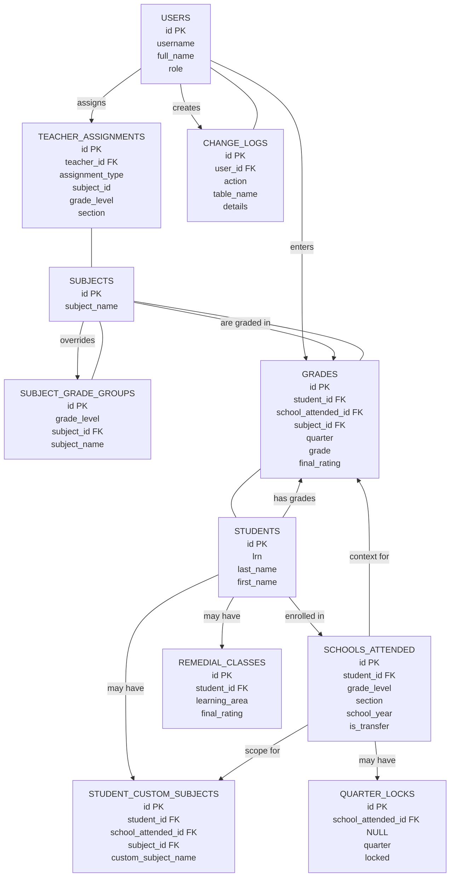
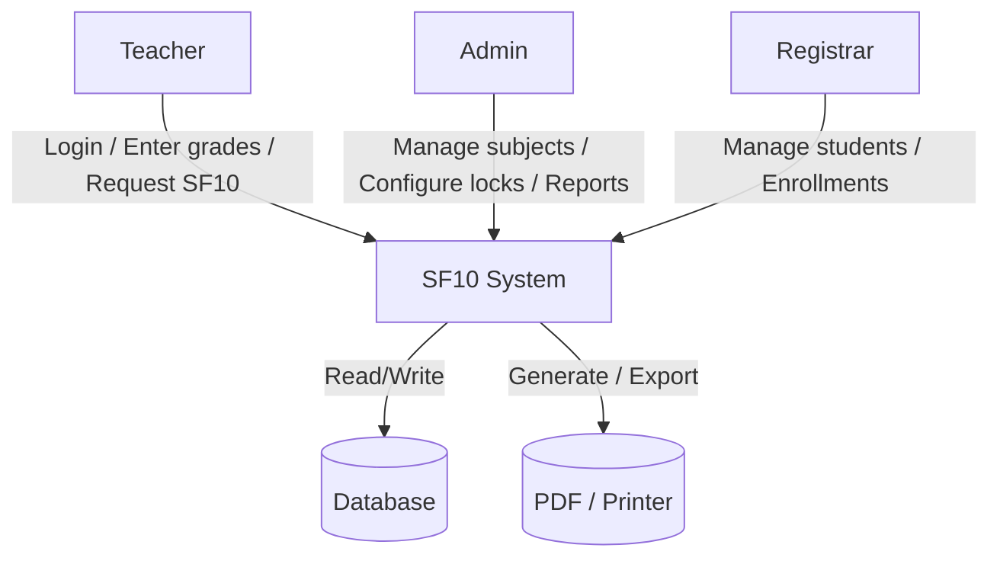
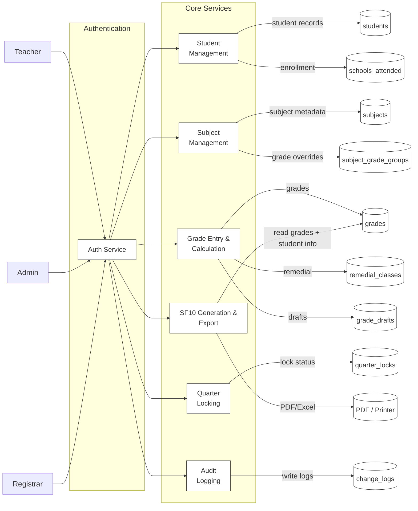
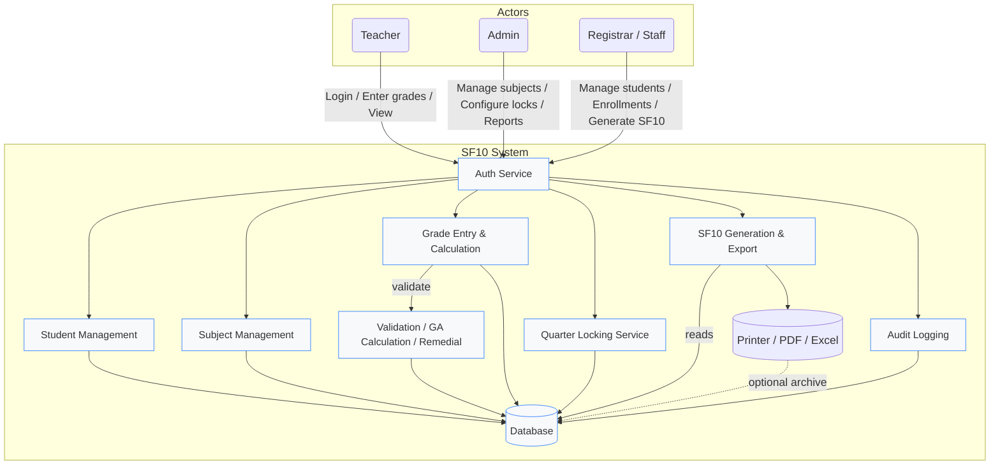
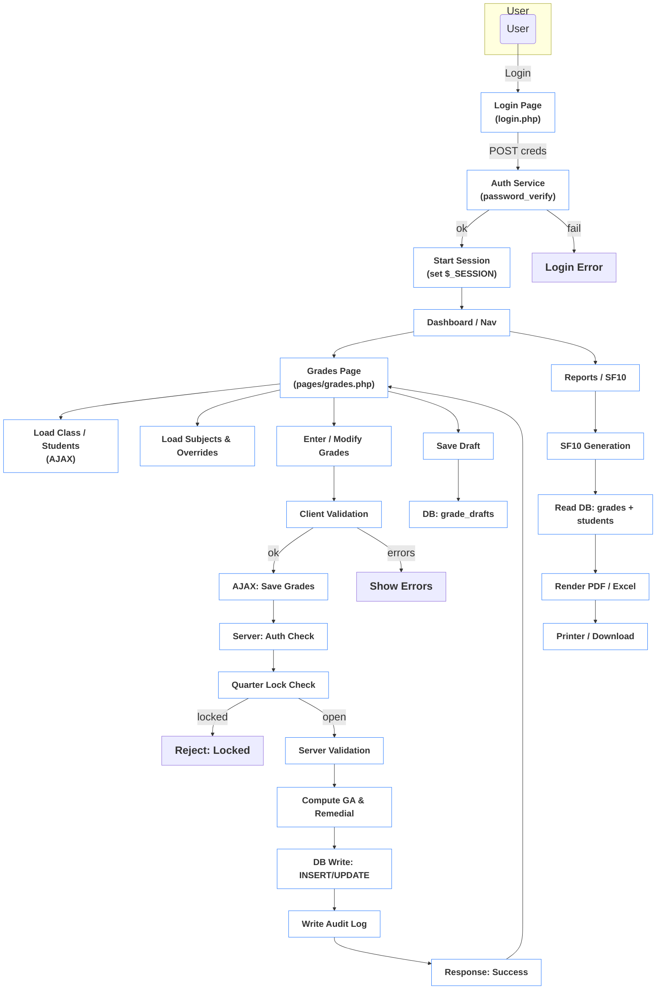

# Data and Process Modelling

This document describes the overall data and process model for the SF10 Learner Record Management System. It contains a Context Diagram, an Entity Relationship Diagram (ERD), and Data Flow Diagrams (DFD) Level 0 and Level 1. Diagrams are provided as Mermaid blocks for easy rendering.

---

**Context Diagram**

The system interacts with external actors: Teachers, Admins, Registrar/Staff, and External Export (Printer/PDF).

Notes: the SF10 System is the central application which authenticates users, enforces permissions and orchestrates data flows to/from the Database and export targets.

---

**Entity Relationship Diagram (ERD)**

Main entities and relationships (simplified). Use a Mermaid ER diagram viewer to render.

Notes: Primary keys and foreign-key relationships are shown. Key tables used by application code include `users`, `students`, `schools_attended`, `subjects`, `grades`, and audit `change_logs`. The DB schema file is included in the repository (for example `sf10_system(6).sql`).

---

**Data Flow Diagram (DFD) — Level 0 (Top-level)**

Notes: Level 0 shows system as a single process interacting with actors and the Database and export destinations.

---

**Data Flow Diagram (DFD) — Level 1 (Detailed)**

Notes: Level 1 breaks the system into logical services: authentication, student management, subject/format configuration, grade entry and calculations (including General Average computation and remedial handling), quarter-locking enforcement (with auto-lock schedules), SF10 generation, and audit logging.

---

**System Flowchart**

The following top-down system flowchart shows actors, main processes, data stores and external export targets in a single system view.

---

Choose whether you want this exported as PNG/SVG, added as a separate `.mmd` file, or further style tweaks.

---

**Program Flowchart**

This flowchart describes the main program-level flows: authentication, page routing, the Grades page save/draft flow (AJAX + server validation + DB upsert), and SF10 generation.

Notes: keep sensitive checks (quarter locks, auth, server validation) on server; client validation is UX-only.

**Data Stores (mapping to DB tables)**
- `users` — authentication and user profile
- `students` — student master data
- `schools_attended` — enrollment records; `is_transfer` and `active` flags
- `subjects` — canonical subjects
- `subject_grade_groups` — per-grade subject display overrides
- `student_custom_subjects` — per-transfer-student subject overrides
- `grades` — per-quarter grades, final ratings, GA rows
- `remedial_classes` — remedial session records
- `quarter_locks`, `quarter_auto_locks`, `quarter_auto_unlocks` — lock status and schedules
- `change_logs` — audit trail
- `grade_drafts` — draft storage (referenced in code; ensure it exists in DB)

---

Assumptions, issues & next steps
- The application contains business rules implemented in code (examples: skip lists for GA calculation, transfer-student overrides). Consider moving those rules to DB configuration to make them editable.
- Ensure `grade_drafts` exists in the runtime DB schema; the SQL dump used to build these docs may be missing it.
- If you want these diagrams exported as PNG/SVG, use a Mermaid renderer (e.g., mermaid.live or the VS Code Mermaid preview). I can also add separate `.mmd` files or commit rendered images to `docs/` if you want.

---

How to render
- Open this file in a Markdown renderer that supports Mermaid (VS Code + Mermaid Preview, GitHub pages with mermaid plugin, or mermaid.live).

---

If you want, I can now:
- Add these diagrams as separate Mermaid files (`docs/*.mmd`) and commit them.
- Generate PNG/SVG exports and add them to `docs/`.
- Produce a short `README.md` that links to this document and the DB schema file `sf10_system(6).sql`.

Choose one and I'll continue.
